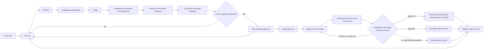

# Saathi flow at a glance

```mermaid
flowchart LR
    C[Customer] --> UI[Chat UI]
    UI --> API[FastAPI]
    API --> G[LangGraph support flow]
    G --> T[Triage]
    T --> I[Investigate and retrieve local playbooks]
    I --> R[Resolve from verified evidence]
    R --> L[LangChain grounded response]
    L --> D{Human approval required?}
    D -- No --> UI
    D -- Yes --> P[Save pending approval]
    P --> E[Email approver]
    P --> UI
    E --> W[Wait up to 20 minutes]
    W --> M[IMAP poller checks every 10 seconds]
    M --> V{Authorized, valid reply received in time?}
    V -- Approved --> X[Record simulated action and approver comment]
    V -- Rejected --> J[Escalate without action]
    V -- No valid reply by deadline --> Z[Expire without action]
    V -- Invalid or no reply yet --> W
    X --> U[Update case and chat]
    J --> U
    Z --> U
    U --> UI
```

Actions in this prototype are simulated; approval does not initiate a real financial transaction.
